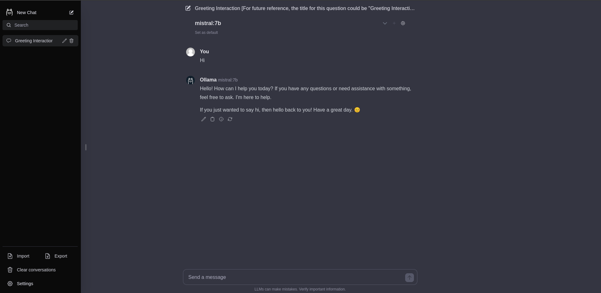

# Ollama Chatbot 🦙

Ollama Chatbot is designed to offer a simplified user interface with minimal features and reduced complexity. The primary focus of this project is on achieving cleaner code through a full TypeScript migration, adopting a more modular architecture, ensuring comprehensive test coverage, and implementing a robust CI/CD pipeline.

## Features ⭐

- **Code Cleanup:** Enhance readability and maintainability of the codebase.
- **Architectural Refactoring:** Implement a more modular architecture with a focus on component separation.
- **TypeScript Migration:** Fully migrate the codebase to TypeScript, providing complete type declarations.
- **Test Implementation:** Introduce a comprehensive suite of tests to ensure code reliability.
- **CI/CD Integration:** Establish a continuous integration and continuous deployment pipeline for automated testing and deployment.
- **Additional Features:** Add new features based on user requests.

## Installation 🚀

Before proceeding with the installation, ensure that you have the following prerequisites:

- Ollama (see [here](https://ollama.ai/)) running at http://localhost:11434/api. 
- Node.js
- npm

Follow these steps to set up ollama-svelte-chatbot:

1. Clone the repository:

   ```bash
   git clone https://github.com/super999christ/ollama-svelte-chatbot.git
   cd ollama-svelte-chatbot
   ```

2. Install the dependencies:

   ```bash
   npm ci
   ```

3. Run the application in development mode:

   ```bash
   npm run dev
   ```

   Ollama Web UI Lite now should be available at http://localhost:3000


